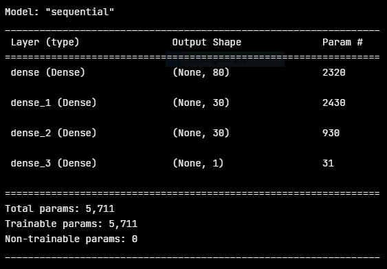
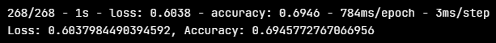
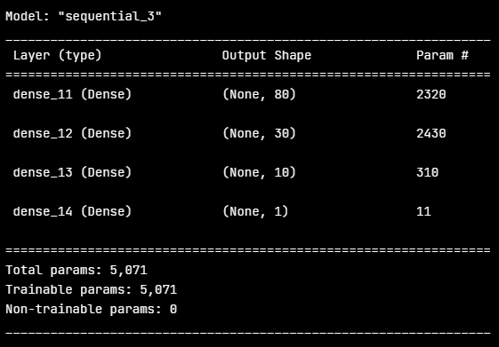
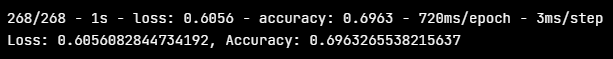
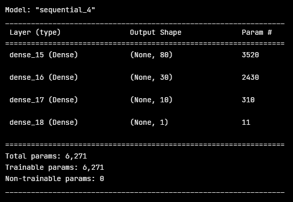
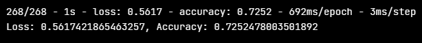

# Neural_Network_Charity_Analysis

## Overview of the analysis:
Using machine learning and neural networks, a model would be created specifically as a neural network binary classifier. This model would be fed a dataset from Alphabet Soup that held their collection of whether applicants will successfully utilize the funds if funded by Alphabet Soup. The model's goal is to be at least **75%** accuracy to be considered a valid model. To fulfill this goal the data was subsequently preprocessed so that the features, hidden layers, targets, nodes, and other variables could be compiled and manipulated in different ways to reach the target goal.
 

## Setting the Groundwork:

To begin the original model created during practicing was ran to collect its structure and a score of 72% accuracy and 56% loss.  
This score subsequently was utilized as a "marking stick" to set the bar and compare against the following attempts to get the model's accuracy at **75%**.

### Data Preprocessing

- The target from the practice remained ***IS_SUCCESSFUL*** due to the fact that it was the only target with non-arbitrary data that established if or if not, a possible applicant was approved.

- For the features, any column that was an active variable, such as ***ASK_AMT***, ***USE_CASE***, ***INCOME_AMT***, ***STATUS***, ***USE_CASE***, and ***AFFILIATION***, ***ORGANIZATION***, and finally ***SPECIAL_CONSIDERATIONS*** were utilized.

- Through the preliminary Deliverables, ***EIN*** and ***NAME*** were dropped from the dataset. On this model's first attempt at raising the accuracy of the model; ***APPLICATION_TYPE*** and ***CLASSIFICATION*** were dropped. This was due to the fact that the former referenced an arbitrary system utilized by Alphabet Soup and the latter being a code used by a governmental entity to classify an organization within their own system. Neither provided any information that would be of any use to the model and were noisy variables.

### Compiling, Training, and Evaluating the Neural Network Model

- To begin the compiling, training and evaluation of the model, I considered that the reason why the original model was not performing to expectation was due to noisy data. The columns ***APPLICATION_TYPE***, and ***CLASSIFICATION*** had been analyzed and binned to take out noisy data, but perhaps the issue was just the columns themselves. In consideration of the projects goal it seemed that these columns did not help the model achieve said goal, but instead were just arbitrary numbers for organization like the ***EIN***, and ***NAME*** columns and thus unnecessary features. Subsequently, the ***APPLICATION_TYPE***, and ***CLASSIFICATION*** columns were dropped in the same cell that dropped the other two columns and the binning process was commented out. An additional new hidden layer with 30 nodes was created and added, and the activation function of **ReLU** was reused for this new hidden layer. This additional layer was created with exactly the same number of nodes and activation function as the previous layer to see the results and how diminished the returns were, if any. The epochs were set to 50 and the model was run.

 Model structure of the first attempt model
  

* While before this run it was assumed that possibly some progress could be made on the performance, it proved instead the changes to the model tanked the performance and showed a decrease in accuracy down to **69%** with a **60%** loss. But, was it the removal of data or the added hidden layer and nodes?

 First model's score
  

- The second attempt kept the column removal and kept the additional layer, but lowered the node count to 10 and changed the activation function to **LeakyReLU**. The epochs were also brought back up to 100. The lowered number of hidden neurons was due to the obvious diminished returns the first attempt showed with using 30 nodes. Changing the activation function to the **LeakyReLU** method was to branch away from the original model’s persistent usage of **ReLU** and possibly have the advantage of the model focusing on different dataset characteristics to improve the outcome.

 Second model's structure
  

* Despite the changes the results for the second attempt showed a like story as the first. Accuracy had just barely increased to **~70%** with the loss score itself just increasing in the decimals by a minor fraction, but stayed roughly **60%**. For this second attempt the little progress the accuracy made was immediately canceled out by the loss amount, which resulted in no change. For the third attempt, something drastic would have to change and the likely subject pointed to my removal of the two columns.

 Second model's score
  

- The third attempt scrapped the column removal of ***"APPLICATION_TYPE"*** and ***"CLASSIFICATION"***, and brought back the original binning as well. The node layer stayed the same since the issue seemed to be the lack of data which gave poorer results, not with the actual model itself. The original assumption by me was that the dropped columns contained arbitrary data that within the context had no correlation as to whether if or if not an approved applicant would utilize the Alphabet Soup's donation properly. This assumption was proven completely incorrect by those first two attempts. The reality was the dataset already started out limited within the context of the task at hand, and taking more data away was not helpful, but detrimental.
This meant that the **LeakyReLU** function remained in the third layer as an activation function, and the third layer itself kept 10 nodes. The only alteration besides restoring the data was that the number of epochs was brought down to 50. The model in both previous attempts seemed to come to its best score at this point and further epochs was unnecessary and a time waste.

 Third model's structure
  

* When the third attempt was run, the results showed an immediate improvement over the previous two attempts with the accuracy being at just ~73% and the loss reducing down to 56%. While this was spectacular since there was a slight improvement over the original model, the massive caveat in the grand scheme of things is that no actual progress had been made. The goal of get above 75% still was a challenge I wanted to give more than three shots at. There were far more things I could do to see if I could get the model to perform better.

 Third model's score
  

### The Aftermath

I ran four further "quick" tests with the model where the epoch was kept at 50 for the same reason it was kept in the previous attempts. Since these were out of the scope of the Challenge and I did not want to waste too much time on this, only one or two things were changed in between tests instead of doing larger overhauls of the model and data as I did in the actual Deliverables.

- With the first new run I changed the ***LeakyReLU*** function to just an ***ReLU** activation function, but kept the 10 nodes in the third layer. This resulted in no change from the Challenges final attempt.

- For the second new run I considered that possibly the APPLICATION_TYPE and CLASSIFICATION binning was too restrictive for the actual density of the data. I decreased the counts thresholds to 300 and 100 respectively.
This resulted in the model performing decimal points worse.

- For the third new attempt I added an additional layer identical in activation as the third layer, but dropped the nodes to 5 for this fourth layer.
The model again stayed nominally the same as the second attempt, if not worse.

- For the fourth attempt I raised the original two hidden layers nodes to 100 and 50 respectively, commented out the layer added in the last attempt, kept the activation functions the same, and the APPLICATION_TYPE and CLASSIFICATION cells were changed back to their original values.
The results again did not change in any way to matter, and I finally concluded that I could not achieve the target performance either by my lack of experience, my lack of knowledge from not fully grasping the concepts, or the data however tweaked was at the core not enough data to hit a **75%** accuracy. The model was changed back to the actual third attempt and the HDF5 file created.

 
 

## Summary:

The end result of the final model could only achieve a **~73%** accuracy score. Just digits away, and nominally better than the original model, but the issue lay somewhere else than the model. Of course, if I had a full grasp on this subject, like a seasoned programmer, no doubt I could get the score to **75%**, but I feel that I would focus more on the data and preprocessing versus the model compilation, training, and evaluation as I did in this exercise. I also would probably have recognized issues with the data itself and properly manipulated the data.

One definitive thing was the data lacked enough variables to be additional targets for the model. While the ***IS_SUCCESSFUL*** is perfect as a binary target, it was the only facet that gave us any information to target. To predict an entities likelihood of successfully utilizing the resources given by Alphabet Soup, you would need information beyond the data in the current dataset. The current dataset is seemingly just information off the application itself and has data that is either arbitrary characters used for other systems with no impact on the question at hand, or rudimentary information. While this information can be utilized by the model, it only tells a very minor part of their financial habits, and possible usage of the funds. From that you can glean a prediction as was shown by this analysis, but to optimize completely you would need data that in of itself tells a story of the applicant. Data that could possibly come post the applicant receiving the funds but before the target ***IS_SUCCESSFUL***. The other possible helpful data can come from a more comprehensive questionnaire that provides insight into these entities past actions and additional qualifiers that can be drilled down to binaries the model can target.
